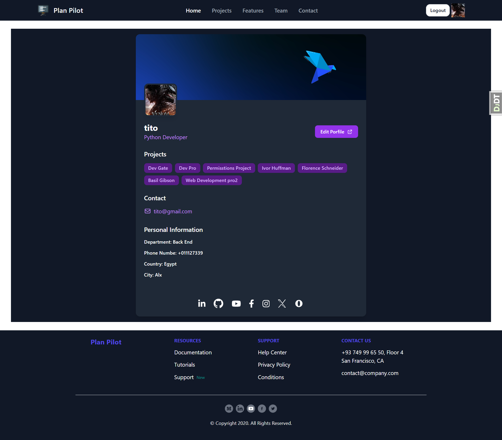

# Plan Pilot ✈️  

## What is PlanPilot?

PlanPilot is a web-based project management 📅 system designed to streamline and enhance the project planning and execution process. It enables teams to create projects, organize tasks into todolists, track progress, share files, and collaborate effectively through a clean, intuitive interface.

## Site screenshot 

| |  |  |
|:---:|:---:|:---:|
| **Homepage**  | **Login**  | **Signup**  |
|  |  |  |
| **Features** | **Project** | **Projects** |
|  |  |  |
| **Contact** | **Teams** | **Todo** |
|  |  |  |
| **Task** | **Form** | **Profile** |
|  |
| **Profile-Form** | 

## Key Features

PlanPilot offers a comprehensive set of features for effective project management:

| **Feature Category**     | **Capabilities**                                                                 |
|--------------------------|----------------------------------------------------------------------------------|
| User Authentication      | Email/password login, Social authentication (Google, Facebook, Twitter)         |
| Project Management       | Create, view, edit, and delete projects                                          |
| Task Organization        | Create todolists to group related tasks, Add tasks with descriptions, Mark tasks as complete |
| File Management          | Upload and organize project-related files                                        |
| Note Taking              | Create and manage project notes                                                  |
| Collaboration            | Share projects with team members                                                 |

## System Architecture

PlanPilot follows a layered architecture pattern with clear separation of concerns, implemented using Django's Model-View-Template (MVT) pattern.

## Django Applications Structure

PlanPilot is organized into multiple Django applications, each responsible for specific system functionality:

1. Main App: Handles core functionality and the main landing pages
2. Account App: Manages user authentication, registration, and profile management
3. Project App: Handles project creation, management, files, and notes
4. Todolist App: Manages todolists within projects
5. Task App: Handles individual task creation and management

This modular organization promotes separation of concerns and makes the codebase more maintainable.

## User Flow and Interactions

The typical user journey in PlanPilot follows a hierarchical pattern that mirrors the relationship between projects, todolists, and tasks.

## Technology Stack

PlanPilot is built using modern web technologies, with Django as its core framework.

| **Component**         | **Technology**                                   |
|-----------------------|--------------------------------------------------|
| Backend Framework     | Django                                           |
| Frontend              | HTML, Tailwind CSS, JavaScript                   |
| Database              | SQLite (default)                                 |
| Authentication        | Django Authentication, Social Auth              |
| Icons                 | Font Awesome                                     |
| Development Tools     | Python Virtualenv                                |

## Getting Started

To set up PlanPilot for development or testing:

1. Clone the repository
2. Set up a Python virtual environment
3. Install dependencies from requirements.txt
4. Apply database migrations
5. Run the Django development server

## System Requirements

The PlanPilot system requires:

- Python 3.6 or higher
- Pip (Python package installer)
- Virtual environment tool (recommended)
- Modern web browser (Chrome, Firefox, Safari, Edge)

## Getting Started

To get started with Plan Pilot, follow these steps:

#### Prerequisites

Ensure that you have the following prerequisites installed on your system:

- Python (version 3.6 or higher)
- Pip (Python package installer)
- Virtualenv (optional but recommended for virtual environment setup)

## Author

- [@mahmoudessam820](https://github.com/mahmoudessam820)

## 🔗 Links

## Feedback

If you have any feedback, please reach out to us at esame4166@gmail.com
